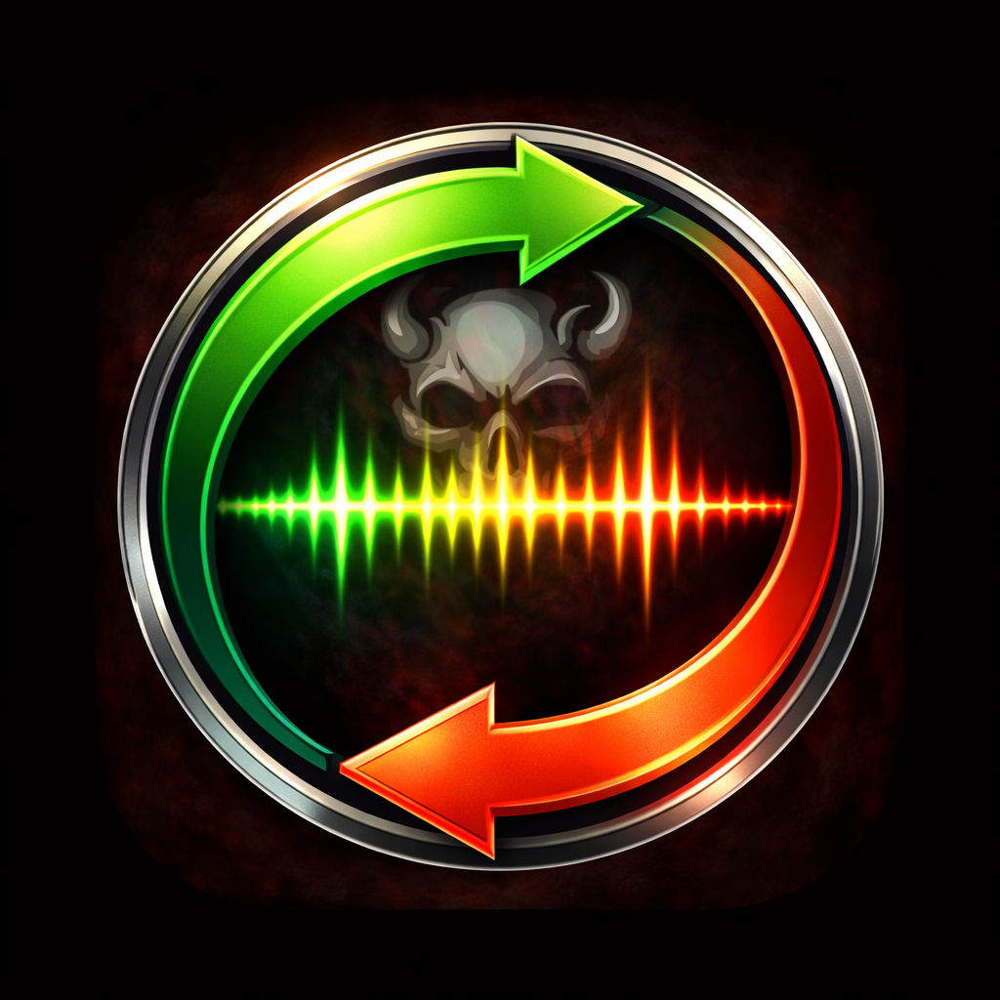
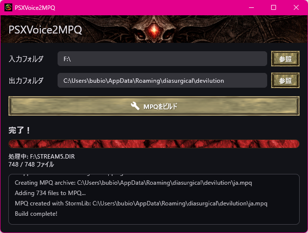

# PSXVoice2MPQ

<p align="center">
  
</p>

<p align="center">
  PlayStation 1版Diabloの音声ファイルをDevilutionX用のMPQ形式に変換するツール
</p>

<p align="center">
  <a href="https://github.com/bubio/PSXVoice2MPQ/releases/latest">
    
  </a>
  <a href="https://github.com/bubio/PSXVoice2MPQ/blob/main/LICENSE">
    
  </a>
</p>

## 概要

PSXVoice2MPQは、PlayStation 1版Diabloのディスクイメージから音声データを抽出し、[DevilutionX](https://github.com/diasurgical/devilutionX)で使用可能なMPQアーカイブに変換します。

<p align="center">
  
</p>


### 機能

- PS1版DiabloのSTREAMファイル（STREAM1-5.DIR/BIN）から音声を抽出
- VAG音声をWAVまたはMP3形式に変換
- **AudioSRによる音声品質向上（オプション）** - AIを使用して11kHzの音声を48kHzに高品質化
- DevilutionX互換のMPQアーカイブを作成
- 並列処理による高速変換
- クロスプラットフォーム対応
- 25以上の言語に対応したUI

### 対応言語（音声）

PS1版Diabloには以下の言語の音声ファイルが含まれています：

| Stream | 言語 | 地域 |
|--------|------|------|
| STREAM1 | 英語 | Europe/USA |
| STREAM2 | フランス語 | Europe/USA |
| STREAM3 | ドイツ語 | Europe/USA |
| STREAM4 | スウェーデン語 | Europe/USA |
| STREAM5 | 日本語 | 日本 |

## 対応プラットフォーム

| OS | アーキテクチャ | ファイル名 |
|----|---------------|-----------|
| macOS | arm64 (Apple Silicon) | `PSXVoice2MPQ-macOS.dmg` |
| Windows | x86_64 (64-bit) | `PSXVoice2MPQ-Windows-x64.zip` |
| Linux | x86_64 (64-bit) | `PSXVoice2MPQ-Linux-x64.tar.gz` |

## インストール

### macOS (Homebrew)

```bash
brew tap bubio/psxvoice2mpq
brew install --cask psxvoice2mpq
```

> **注意**: このアプリはAppleによるノータリゼーション（公証）を受けていないため、初回起動時にGatekeeperによってブロックされる場合があります。以下のいずれかの方法で回避できます：
>
> **方法1: ターミナルで隔離フラグを削除**
> ```bash
> xattr -cr /Applications/PSXVoice2MPQ.app
> ```
>
> **方法2: システム設定から許可**
> 1. アプリを開こうとしてブロックされた後
> 2. 「システム設定」→「プライバシーとセキュリティ」を開く
> 3. 「"PSXVoice2MPQ"は開発元を確認できないため、使用がブロックされました」の横にある「このまま開く」をクリック

### 直接ダウンロード

[Releases](https://github.com/bubio/PSXVoice2MPQ/releases)ページから最新版をダウンロードしてください。

## 使い方

1. **PSXVoice2MPQを起動**
2. **入力フォルダを選択**: STREAM*.DIRとSTREAM*.BINファイルが含まれるフォルダを選択
3. **出力フォルダを選択**: MPQファイルの保存先を選択
4. **「MPQをビルド」をクリック**: 変換処理が開始されます

### 出力ファイル

言語コード別にMPQファイルが生成されます：

- `en.mpq` - 英語音声
- `fr.mpq` - フランス語音声
- `de.mpq` - ドイツ語音声
- `sv.mpq` - スウェーデン語音声
- `ja.mpq` - 日本語音声

### DevilutionXでの使用

生成されたMPQファイルをDevilutionXのデータフォルダにコピーしてください：

- **macOS**: `~/Library/Application Support/diasurgical/devilution/`
- **Windows**: `%APPDATA%\diasurgical\devilution\`
- **Linux**: `~/.local/share/diasurgical/devilution/`、またはFlatpackでインストールした場合は、`~/.var/app/org.diasurgical.DevilutionX/data/diasurgical/devilution/`

## AudioSR による音声品質向上

PS1版Diabloの音声ファイルは11kHzという低いサンプルレートで収録されています。PSXVoice2MPQは[AudioSR](https://github.com/haoheliu/versatile_audio_super_resolution)を使用して、AIによる音声超解像技術でこれを48kHzに高品質化することができます。

### AudioSRの特徴

- **音声超解像**: 11kHzの低品質音声を48kHzの高品質音声にアップスケーリング
- **AIベースの処理**: ディープラーニングモデルにより、単純なリサンプリングでは得られない高音質を実現
- **キャッシュ機能**: 一度処理したファイルはキャッシュされ、再変換時に再利用
- **処理時間に注意**: GPU環境でも処理に時間がかかります（CPUのみの場合はさらに長時間）

### AudioSRのインストール

AudioSRを使用するには、事前にインストールが必要です：

```bash
# pipでインストール（Python 3.8以上が必要）
pip install audiosr

# または、condaでインストール
conda install -c conda-forge audiosr
```

インストール後、PSXVoice2MPQの設定画面でAudioSRを有効にできます。`audiosr`コマンドが見つからない場合は、実行ファイルのパスを手動で指定してください。

### 処理時間の目安

AudioSRによる処理は、ハードウェア性能に大きく依存します：

- **GPU（CUDA対応）**: 高速に処理可能
- **CPU のみ**: 非常に長い時間がかかります（数時間〜）

処理を中断しても、キャッシュされたファイルは保持されるため、次回の変換時に続きから処理できます。

## オプション依存関係

### MP3出力

MP3出力（ファイルサイズ削減）を利用する場合は、以下のいずれかをインストールしてください：

- **lame**（推奨）: `brew install lame` / `apt install lame` / `choco install lame`
- **ffmpeg**: `brew install ffmpeg` / `apt install ffmpeg` / `choco install ffmpeg`

どちらもインストールされていない場合は、WAV形式で保存されます。

### AudioSR（音声品質向上）

上記「AudioSR による音声品質向上」セクションを参照してください。

## ソースからのビルド

### 必要なもの

- [Flutter](https://flutter.dev/) 3.38.7
- プラットフォーム別のビルドツール：
  - **macOS**: Xcode
  - **Windows**: Visual Studio（C++ワークロード）
  - **Linux**: GTK3開発ライブラリ

### ビルドコマンド

```bash
# リポジトリをクローン
git clone https://github.com/bubio/PSXVoice2MPQ.git
cd PSXVoice2MPQ

# 依存関係をインストール
flutter pub get

# ビルド
flutter build macos --release  # macOS
flutter build windows --release  # Windows
flutter build linux --release  # Linux
```

## ライセンス

このプロジェクトはMITライセンスの下で公開されています。詳細は[LICENSE](LICENSE)ファイルを参照してください。

## 謝辞

- [DevilutionX](https://github.com/diasurgical/devilutionX) - Diabloソースポート
- [psx-tools](https://github.com/diasurgical/psx-tools) - PS版Diabloデータ変換ツール
- [StormLib](https://github.com/ladislav-zezula/StormLib) - MPQアーカイブライブラリ
- [AudioSR](https://github.com/haoheliu/versatile_audio_super_resolution) - AI音声超解像
- PlayStation 1版Diablo - 開発: Climax Studios、販売: Electronic Arts

## 法的事項

このツールを使用するには、PlayStation 1版Diabloの正規コピーを所有している必要があります。本ツールには著作権で保護されたゲームアセットは含まれていません。
